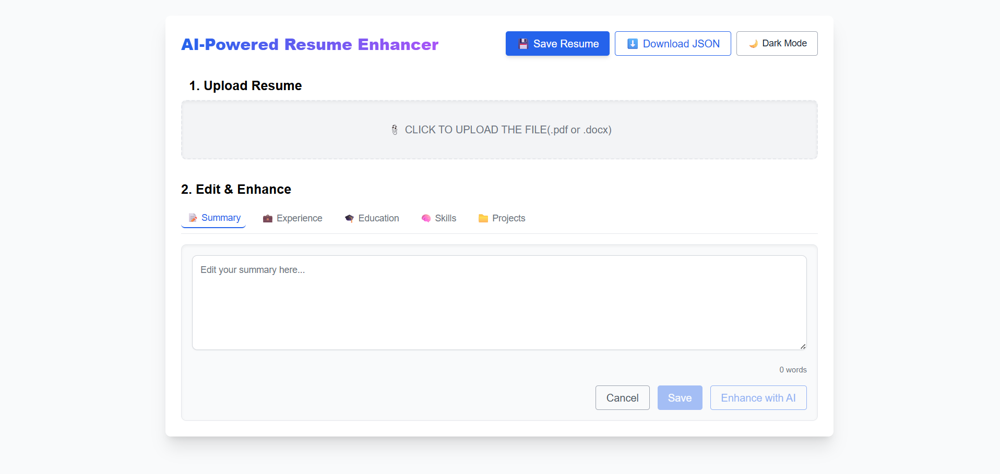
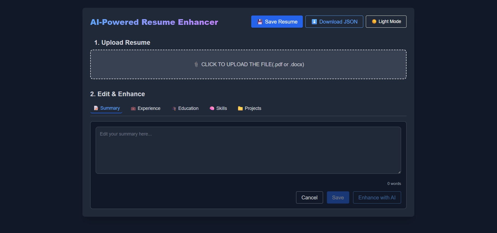

# 💼 AI Resume Enhancer 🧠

The AI Resume Enhancer is a full-stack web application designed to streamline and intelligently elevate the resume editing process. Built with React (frontend) and FastAPI (backend), this tool allows users to upload their resumes in .pdf or .docx formats, automatically extracts key sections such as summary, experience, education, skills, and projects, and provides AI-driven enhancements to improve content clarity, impact, and professionalism.

> ✨ Designed to meet the requirements of the Internshala assignment with a recruiter-focused and professional UI/UX.

---

 
## 🧰 Tech Stack

| Frontend | Backend | Others |
|----------|---------|--------|
| React  | FastAPI | Tailwind CSS |
| JavaScript (ES6+) | Python 3.9+ | React Toast |
| FileReader API | PyPDF2 / python-docx | @fontsource/inter |

---

## 📋 Key Features

- 📎 Upload `.pdf` or `.docx` resumes
- 🧠 Smart section detection (Summary, Experience, Education, Skills, Projects)
- ✍️ Clean editor with Dark Mode
- 🤖 AI enhancement for polished wording
- 💾 Save resume as `.json`
- ⬇️ Download JSON for offline editing
- ✅ Word count, save state, and change detection
- 🌗 Light/Dark theme toggle
- 📦 No external databases used

---

## 🗂 Folder Structure

| Folder/File              | Description                                                             |
| ------------------------ | ----------------------------------------------------------------------- |
| `backend/`               | Contains FastAPI backend logic                                          |
| ├── `main.py`            | Core backend API for uploading, enhancing, and saving resume data       |
| └── `requirements.txt`   | Python dependencies required to run the backend                         |
| `frontend/`              | Contains the React-based frontend UI                                    |
| ├── `src/`               | All source components and main React logic                              |
| │   └── `App.js`         | Main application component with logic for editing and enhancing resumes |
| ├── `public/`            | Static files served by React                                            |
| ├── `tailwind.config.js` | Tailwind CSS configuration file                                         |
| ├── `package.json`       | Project metadata and list of frontend dependencies                      |
| └── `README.md`          | Project documentation and setup guide                                   |

---

## 📦 Requirements

### Backend (Python)
- Python 3.9+
- FastAPI
- uvicorn
- PyPDF2
- python-docx
- pydantic

### Frontend , Backend setup and cloning steps are as follows:

🛠 Prerequisites
Git installed on the system (Download Git)

Node.js installed (for frontend) – Download Node.js

Python installed (for backend) – Download Python

1. Open Terminal / PowerShell / Command Prompt
2. Clone the Repository
3. command for cloning : git clone https://github.com/your-username/ai-resume-enhancer.git
4. cd ai-resume-enhancer

After this use the following steps to setup backend and fronend

#### 🔧 Backend Setup
Note: All the requirements for the backend code is written in the requirement.txt file which is present 
inside the backend folder. To install it follow these steps

cd backend
pip install -r requirements.txt

#### 🔧 Frontend Setup
- All the dependencies are present inside the package.json file just follow these steps:

- cd frontend
- npm install

- "npm install" this comand will install all the packges required for the forntend code to run

- After all these run the front end and backend code

-For Frontend
  - cd forntend
  - npm start

-For Backend
  - cd backend
  - uvicorn main:app --reload

# How Enhancement works
 - Once a resume is uploaded, the app auto-populates all fields.
 - The Enhance with AI button will remain disabled until the user make any change in the           selected field.
 - Once edited, the button becomes active and allows you to send the updated content for AI        enhancement.
 - This prevents redundant enhancements and improves clarity for the user.

# The following images are the ui of the app dark and light mode both

